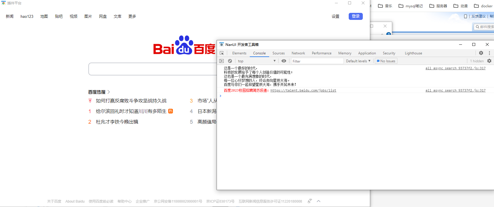

# 1、通过nuget获取ClayMini包


# 2、写一小撮代码

2.1、在Program.cs代码中添加

```c#
using NetDimension.NanUI;
using System;
using System.Collections.Generic;
using System.Linq;
using System.Threading.Tasks;
using System.Windows.Forms;

namespace NanUIDemo3
{
    internal static class Program
    {
        /// <summary>
        /// 应用程序的主入口点。
        /// </summary>
        [STAThread]
        static void Main()
        {
            //AppDomain.CurrentDomain.AssemblyResolve += CurrentDomain_AssemblyResolve;

            Application.EnableVisualStyles();
            Application.SetCompatibleTextRenderingDefault(false);

            //Application.Run(new Form1());

            // ...
            WinFormium.CreateRuntimeBuilder(env => {

                env.CustomCefSettings(settings =>
                {
                    // 在此处设置 CEF 的相关参数
                });

                env.CustomCefCommandLineArguments(commandLine =>
                {
                    // 在此处指定 CEF 命令行参数
                });

            }, app =>
            {
                app.UseEmbeddedFileResource("http", "assembly.app.local", "wwwroot/dist");
                //app.UseLocalFileResource("http", "static.app.local", @"./dist");
                //app.UseLocalFileResource("http", "static.app.local", @"D:/VueProject/plugin/dist");
                // 指定启动窗体
                app.UseMainWindow(context => new MainWindow());
            })
            .Build()
            .Run();
        }
    }
}
```

2.2、添加MainWindow.cs代码

```c#
using ClayMini.Config;
using NetDimension.NanUI;
using NetDimension.NanUI.HostWindow;
using System;
using System.Collections.Generic;
using System.Drawing.Imaging;
using System.Drawing;
using System.Linq;
using System.Text;
using System.Threading.Tasks;

namespace NanUIDemo3
{
    class MainWindow : Formium
    {
        // 设置窗体样式类型
        public override HostWindowType WindowType => HostWindowType.System;
        // 指定启动 Url
        public override string StartUrl => "https://www.baidu.com";
        //public override string StartUrl => "http://static.app.local/index.html";
        //public override string StartUrl => "http://assembly.app.local/index.html";
        public MainWindow()
        {
            Title = "插件平台";
            // 在此处设置窗口样式
            Size = new System.Drawing.Size(1280, 720);
        }
        protected override void OnReady()
        {

            // 在此处进行浏览器相关操作
#if DEBUG
            //debugger 环境
            ShowDevTools();
#else
            //release 环境
#endif
            //Mapping mapping = Mapping.getInstance();
            //var obj = mapping.getTargetAttributeMethod("TEKLALIB");
            //Console.WriteLine(obj.Count);
            //RegisterJavaScriptObject("TEKLALIB", obj);
        }
    }
}

```


# 3、测试

