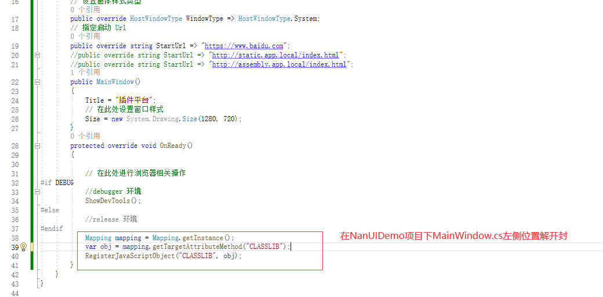

# 1、新建NanUI项目

## 1.1、新建项目


## 1.2、通过nuget获取ClayMini包


项目结构如下：


## 1.3、在Program.cs代码中添加

```c#
using NetDimension.NanUI;
using System;
using System.Collections.Generic;
using System.Linq;
using System.Threading.Tasks;
using System.Windows.Forms;

namespace NanUIDemo3
{
    internal static class Program
    {
        /// <summary>
        /// 应用程序的主入口点。
        /// </summary>
        [STAThread]
        static void Main()
        {
            //AppDomain.CurrentDomain.AssemblyResolve += CurrentDomain_AssemblyResolve;

            Application.EnableVisualStyles();
            Application.SetCompatibleTextRenderingDefault(false);

            //Application.Run(new Form1());

            // ...
            WinFormium.CreateRuntimeBuilder(env => {

                env.CustomCefSettings(settings =>
                {
                    // 在此处设置 CEF 的相关参数
                });

                env.CustomCefCommandLineArguments(commandLine =>
                {
                    // 在此处指定 CEF 命令行参数
                });

            }, app =>
            {
                // 指定启动窗体
                app.UseMainWindow(context => new MainWindow());
            })
            .Build()
            .Run();
        }
    }
}
```

## 1.4、添加MainWindow.cs代码

```c#
using ClayMini.Config;
using NetDimension.NanUI;
using NetDimension.NanUI.HostWindow;
using System;
using System.Collections.Generic;
using System.Drawing.Imaging;
using System.Drawing;
using System.Linq;
using System.Text;
using System.Threading.Tasks;

namespace NanUIDemo3
{
    class MainWindow : Formium
    {
        // 设置窗体样式类型
        public override HostWindowType WindowType => HostWindowType.System;
        // 指定启动 Url
        public override string StartUrl => "https://www.baidu.com";
        public MainWindow()
        {
            Title = "插件平台";
            // 在此处设置窗口样式
            Size = new System.Drawing.Size(1280, 720);
        }
        protected override void OnReady()
        {

            // 在此处进行浏览器相关操作
#if DEBUG
            //debugger 环境
            ShowDevTools();
#else
            //release 环境
#endif
            //Mapping mapping = Mapping.getInstance();
            //var obj = mapping.getTargetAttributeMethod("CLASSLIB");
            //RegisterJavaScriptObject("CLASSLIB", obj);
        }
    }
}

```

## 1.5、运行测试


# 2、添加插件LIB形成MVC架构

## 2.1、创建新类库


## 2.2、通过nuget获取ClayMini包


为项目构造如下结构：


## 2.3、在RespBean.cs添加如下代码

```c#
using ClayMini.Config;
using System;
using System.Collections.Generic;
using System.Linq;
using System.Text;
using System.Threading.Tasks;

namespace CLASSLIB.Config
{
    [MapModel]
    public class RespBean
    {
        public int code { get; set; }
        public string message { get; set; }
        public object obj { get; set; }

        public object obj2 { get; set; }

        public RespBean(int code, string message, object obj, object obj2)
        {
            this.code = code;
            this.message = message;
            this.obj = obj;
            this.obj2 = obj2;
        }

        public static RespBean success(string message)
        {
            return new RespBean(200, message, null, null);
        }
        public static RespBean success(string message, object obj)
        {
            return new RespBean(200, message, obj, null);
        }

        public static RespBean success(string message, object obj1, object obj2)
        {
            return new RespBean(200, message, obj1, obj2);
        }

        public static RespBean error(string message)
        {
            return new RespBean(500, message, null, null);
        }

        public static RespBean error(string message, object obj)
        {
            return new RespBean(500, message, obj, null);
        }
    }
}

```

## 2.4、在ProjectController.cs添加如下代码

```c#
using CLASSLIB.Config;
using CLASSLIB.Project.Server;
using ClayMini.Config;
using System;
using System.Collections.Generic;
using System.Linq;
using System.Text;
using System.Threading.Tasks;

namespace CLASSLIB.Project.Controller
{
    [MapClass]
    public class ProjectController
    {
        ProjectServer partServer = ProjectServer.getInstance();

        [MapMethod]
        public RespBean testMethod()
        {
            return RespBean.success("成功", partServer.testMethod());
        }
    }
}

```

## 2.5、在Project.cs添加如下代码

```C#
using CLASSLIB.Config;
using ClayMini.Config;
using System;
using System.Collections.Generic;
using System.Linq;
using System.Text;
using System.Threading.Tasks;

namespace CLASSLIB.Project.Model
{
    [MapModel]
    public class Project
    {
        public Project()
        {

        }
        public long id { get; set; }
    }
}

```

## 2.6、在Project.cs添加如下代码

```c#
using ClayMini;
using System;
using System.Collections.Generic;
using System.Linq;
using System.Text;
using System.Threading.Tasks;

namespace CLASSLIB.Project.Server
{
    public class ProjectServer : Singleton<ProjectServer>
    {
        public Model.Project testMethod() {
            Model.Project project = new Model.Project();
            project.id = 1L;
            return project;
        }
    }
}

```

## 2.7、解开封印



## 2.8、运行测试


**恭喜你做完这一步你就获得了一个基于NanUI的MVC架构**


#  打赏和赞助

ClayMini是基于NanUI的开源项目，它是完全免费的。如果您喜欢这个项目，您可以通过下述方式支付一杯咖啡钱请作者喝一杯咖啡，或者您或者您所在的企业需要我这样的人才也可以联系我。

使用微信或者支付宝扫描下方二维码来进行资金方面的捐助。


